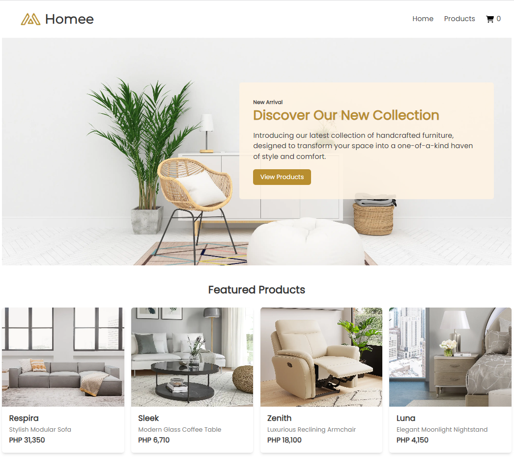

## Setting up the local server:

### Download XAMPP

1. Go to [https://www.apachefriends.org/index.html](https://www.apachefriends.org/index.html).
2. Choose the version of XAMPP that is compatible with your operating system and install it.

### Install XAMPP

1. You will be requested to select which components to install during the installation process. Make sure that "Apache" and "MySQL" are selected.
2. You will also be prompted to indicate where you want XAMPP to be installed. It is best to use the default directory, which is usually "C:\xampp."
3. Launch the XAMPP control panel once the installation is complete.
4. Start both the Apache and MySQL services from the XAMPP control panel.

## Prepare Project Folder

### Download the Project:

1. Visit the project's GitHub repository at [https://github.com/jajagel/homee](https://github.com/jajagel/homee)
2. Download the project as a .zip file.

### Extract and Organize the Project:

1. Locate and extract the contents of the downloaded.zip file.
2. Rename the extracted folder. In this case, let's rename it to "homee" to match the project name.
3. Place the extracted folder to "C:\xampp\htdocs"

## Setting up the database:

### Access PHPMyAdmin:

1. Open the web browser and go to [http://localhost/phpmyadmin](http://localhost/phpmyadmin)

### Create Database and Import Data:

1. Inside PHPMyAdmin, create a new database named "homee_db"
2. Then, look for the "homee_db.sql" file within the project folder's "database" directory.
3. Import the SQL file into your "homee_db" database.

## Running the project

### Test the Website:

1. Navigate to your browser and type in “localhost/homee”
2. The URL should load the web application.

## Screenshots

