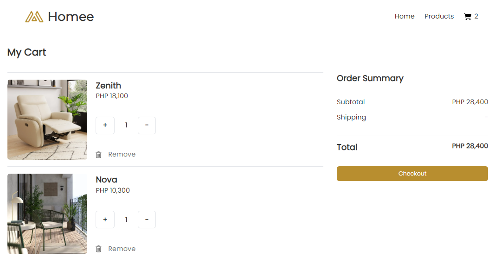

## Setting up the local server:

### Download XAMPP

1. Go to the official XAMPP website at [https://www.apachefriends.org/index.html](https://www.apachefriends.org/index.html).
2. Select the version of XAMPP that is compatible with your operating system and proceed with the installation.

### Install XAMPP

1. During the installation process, you will be prompted to choose which components to install. Make sure to select "Apache" and "MySQL"
2. You'll also be asked to specify the directory where you want XAMPP to be installed. It's recommended to use the default directory, which is usually "C:\xampp."
3. After the installation is complete, launch the XAMPP control panel.
4. In the XAMPP control panel, start both the Apache and MySQL services.

## Prepare Project Folder

### Download the Project:

1. Visit the GitHub repository of the project at [https://github.com/jajagel/homee](https://github.com/jajagel/homee)
2. Download the project as a .zip file.

### Extract and Organize the Project:

1. Locate the downloaded .zip file and extract its contents.
2. Rename the extracted folder. In this case, let's rename it to "homee" to match the project name.
3. Move the extracted project folder to "C:\xampp\htdocs"

## Setting up the database:

### Access PHPMyAdmin:

1. Open the web browser and go to [http://localhost/phpmyadmin](http://localhost/phpmyadmin)

### Create Database and Import Data:

1. Inside PHPMyAdmin, create a new database named "homee_db"
2. Then, look for the "homee_db.sql" file within the project folder's "database" directory.
3. Import the SQL file into your "homee_db" database.

## Running the project

### Test the Website:

1. Navigate to your browser and type in “localhost/homee”
2. The URL should load the web application.

# Screenshots

